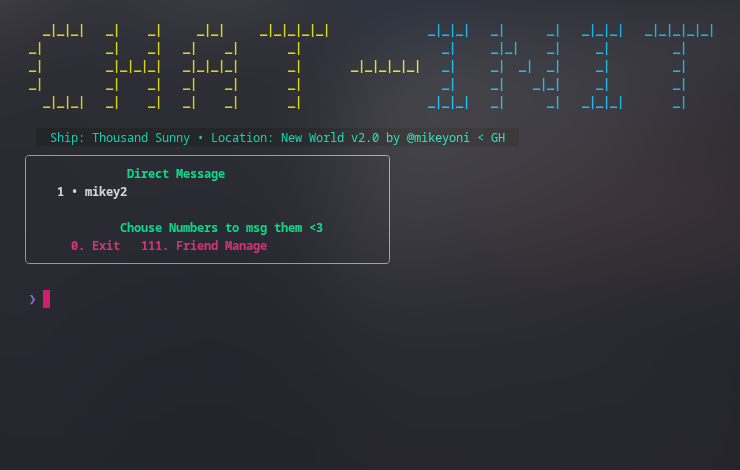
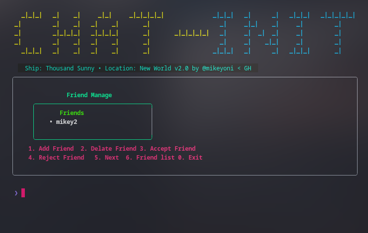
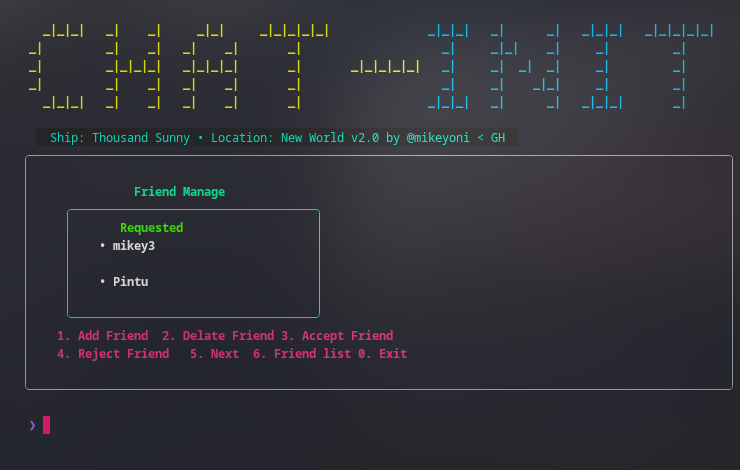
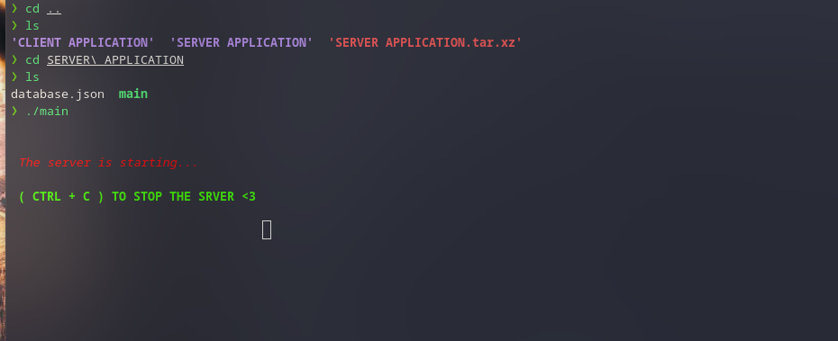
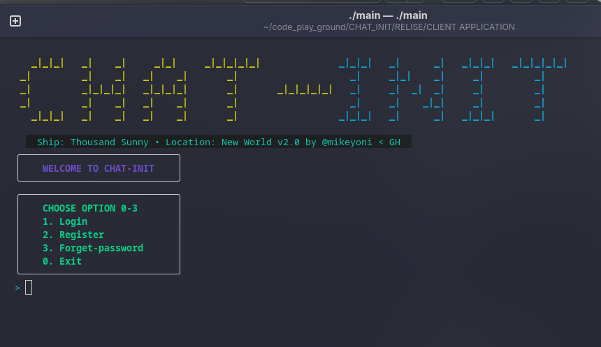
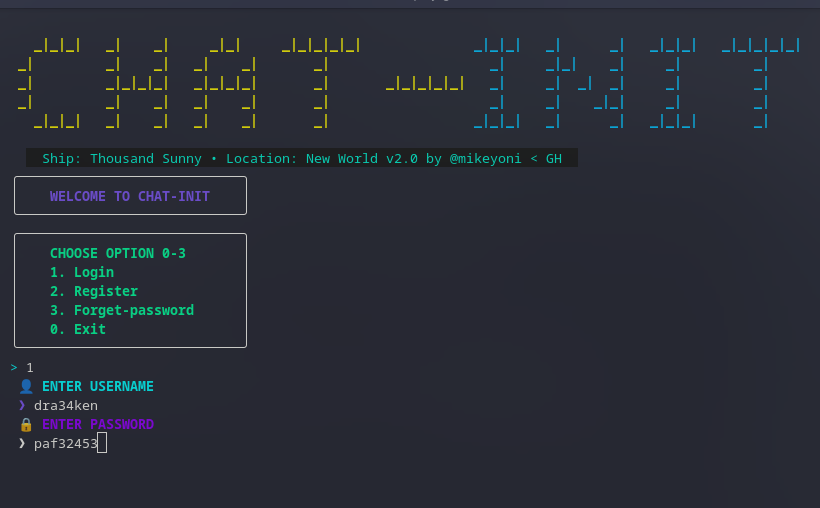
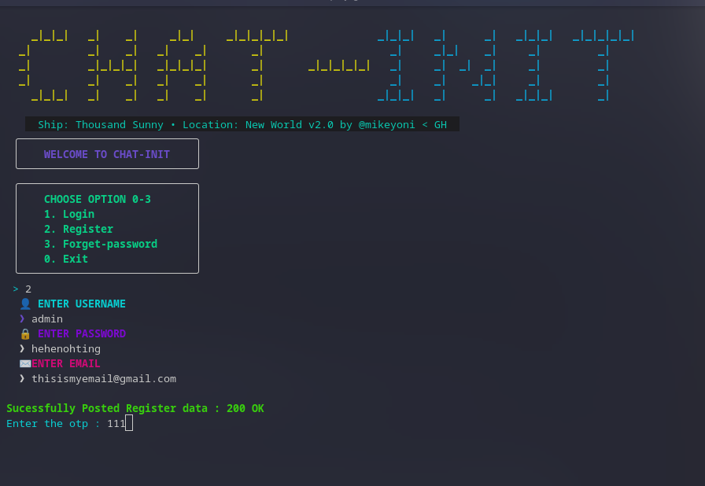
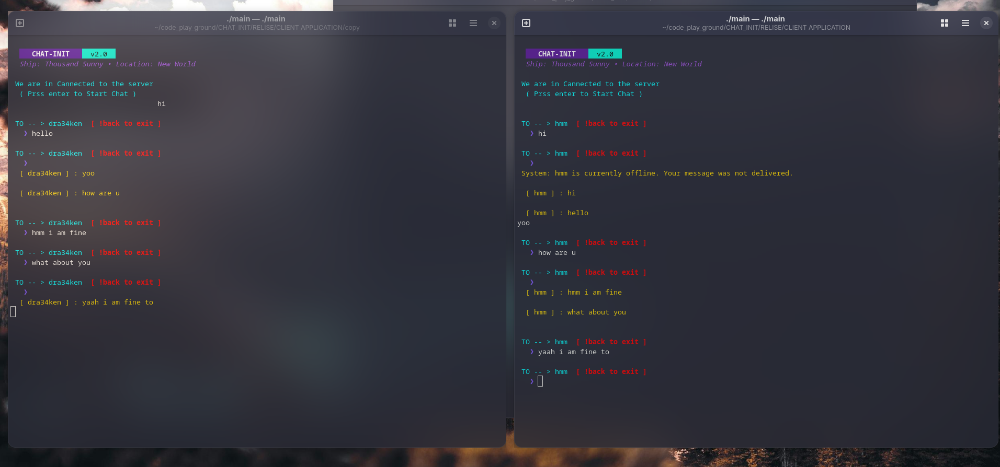

# 🏴‍☠️ CHAT-INIT
### *High-Performance Go CLI Chat Protocol*

**CHAT-INIT** is a real-time, WebSocket-based terminal chatting application. Built for developers who live in the shell, it strips away the bloat of modern GUIs in favor of speed, efficiency, and a "Pirate King" aesthetic.

---

## 📸 Screenshots (The New World)

| | | |
|:---:|:---:|:---:|
|  |  |  |
|  |  |  |
|  |  | |

---

## 🚀 Key Features
* **Real-time Core:** Instant messaging powered by a Go-powered WebSocket backend.
* **The "111" Dashboard:** A dedicated hub to manage your pirate crew (Add, Delete, Accept, Reject).
* **TUI Excellence:** Beautiful terminal borders and layouts optimized for **Fedora Workstation**.
* **Smart Navigation:** Robust menu logic that handles inputs and errors without crashing.
* **Global State Sync:** Optimized memory usage with global slice tracking for instant UI refreshes.

---

## ⚙️ Critical Configuration (For OTP)
To enable the registration and OTP (One-Time Password) system, you must configure your environment variables.

1. Create a `.env` file in the root directory.
2. Generate a **Google App Password** (since standard Gmail passwords are blocked for third-party apps).
3. Add your credentials to the `.env`:

```env
GMAIL_USER=your-email@gmail.com
GMAIL_PASS=your-16-character-app-password
```

---

## 🛠 Tech Stack
* **Language:** Go (Golang)
* **Protocol:** Gorilla WebSockets
* **UI Framework:** Charmbracelet Lipgloss
* **Target OS:** Linux (Optimized for Fedora 43 / GNOME Terminal / Kitty)

---

## 📥 Installation & Setup

### 1. Clone the Source
```bash
git clone [https://github.com/mikeyoni/CHAT_INIT.git](https://github.com/mikeyoni/CHAT_INIT.git)
cd CHAT_INIT
```

### 2. Start the Server
```bash
cd server
go run main.go
```

### 3. Launch the Client
```bash
cd client
go run main.go
```

---

## 🎮 How to Command
* **Identify:** Enter your Pirate alias upon login.
* **Manage Crew:** Type `111` to enter **Friend Management**.
* **Toggle Views:** Use `5` to view Pending Requests and `6` to return to your Friend List.
* **Engage:** Select a friend's number from the DM list to open a chat.
* **Retreat:** Use `0` to safely terminate the connection and exit.

---

## ⚓ Connect with the Developer
* **Discord:** `@ui_mikey`
* **Instagram:** `@ui__mikey`
* **GitHub:** [mikeyoni](https://github.com/mikeyoni)

> "Built for the terminal, by a developer who lives in it." — **Mikey**

---

## 📜 License
This project is licensed under the MIT License.
```
